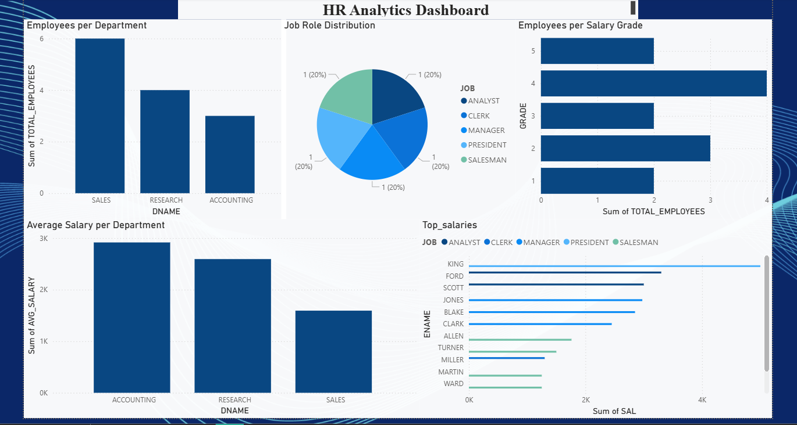

# HR Analytics Dashboard Project

## 📊 Tools Used
- SQL (MySQL / Oracle SQL)
- Microsoft Excel
- Power BI

## 📌 Project Description
This project analyzes employee data using SQL queries and visualizes insights using Power BI dashboard.

## 📈 Key Insights
- Employees per department
- Job role distribution
- Salary analysis
- Average salary per department

## 🖼 Dashboard Preview

## 📂 Project Files
- SQL_Queries.sql
- HR_Analytics_Data.xlsx
- PowerBI_Dashboard.pbix
- dashboard.png
